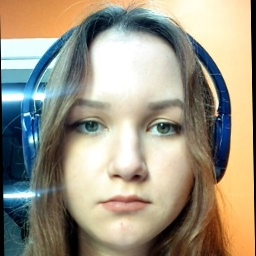
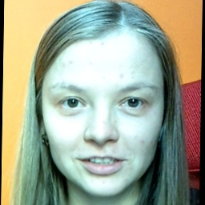
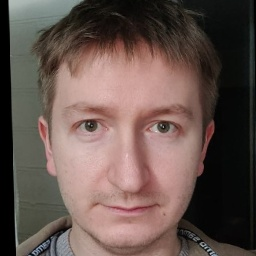

[EN](./README.md) | [RU](./README.ru.md)

RECONSTRUCTION OF THE TEST EMBEDINGS:
 - download archive: https://disk.yandex.ru/d/cTriN6tMzgHxUw

SCREENCASTS:
 - how to run training of the decoder/adapter: https://disk.yandex.ru/i/LpYopyLJYWYe4A
 - how to run validation: https://disk.yandex.ru/i/qgAYH3wQyz967w
 - how to run reconstruction demo: https://disk.yandex.ru/i/7Eu7Hu73S4tr1Q
 - how to run protection demo: https://disk.yandex.ru/i/8Jl8nJUhlVOAvA

RBH24
===

This is SystemFailure solution for Russian Biometric Hackaton 2024

We have shown:

1. Biometric template could be reconstructed to a face photo with high cosine similarity score with the original template. 
For two test sets, for our strongest reconstruction algorithm, we have measured positive match rate to be 100 %.

Table 1 - reconstruction performance

| Test set         | IDs  | Samples/ID | Demographics        | PMR@1E-6 (Our decoder) | PMR@1E-6 (Our adapter for InstantID) | PMR@1E-6 (Our decoderV2) |
|------------------|------|------------|---------------------|------------------------|--------------------------------------|--------------------------|
| **valface**      | 1143 | 1          | White, Black, Asian | 34.2 %                 | 75.9 %                               | 100 %                    |
| **glint**        | 1000 | 1          | White, Black, Asian | 25.3 %                 | 78.3 %                               | 100 %                    |
| **embedding_v3** | 101  | N/A        | N/A                 | N/A                    | 87.1 %                               | 100 %                    |

Where:

 - PMR@1E-6 is positive match rate for `insightface/buffalo_l` at [False Match Rate 1E-6](./researches/README.md)

 - **valface** - Manually collected photos. Mostly non-famous persons

 - **glint** - Subset of first 1K ids from glint dataset. Divergent poses, blurred faces, emotions, occlusions

2. To make reconstruction algorithm relatively small data could be stollen from biometric system. Our strongest 
reconstruction algorithm was trained on only 4K high quality photo-template pairs!

3. We have developed and evaluated a robust yet computationally efficient method for the protection of biometric
templates against reconstruction attacks. This approach utilizes facial landmark coordinates to generate encryption
keys. Our analysis demonstrates that the proposed protection method maintains the performance of biometric 
identification systems, preserving both False Non-Identification Rate (FNIR) and False Positive Identification
Rate (FPIR) at their original levels, while effectively reducing the positive match rate of reconstructed
facial images to zero.

Table 2 - protection performance

| Metric                               | Our adapter for InstantID | Our decoder       | Our decoderV2     |
|--------------------------------------|---------------------------|-------------------|-------------------|
| **Number of Unique Identifications** | 1777                      | 1777              | 1777              |
| **Cosine Min**                       | -0.1827                   | -0.1728           | -0.1735           |
| **Cosine Mean**                      | 0.0190                    | 0.0120            | 0.0091            |
| **Cosine Median**                    | 0.0166                    | 0.0111            | 0.0101            |
| **Cosine Max**                       | 0.1953                    | 0.1761            | 0.1539            |
| **PMR@FMR=1E-6**                     | 0 of 1777 (0.0 %)         | 0 of 1777 (0.0 %) | 0 of 1777 (0.0 %) |

### Examples

| Original photo               | Our adapter for InstantID                                     | Our decoder                                      | Our decoderV2                                      |
|------------------------------|---------------------------------------------------------------|--------------------------------------------------|----------------------------------------------------|
|  | .jpg) | .png) | .png) |
|                              | Cosine: 0.7578                                                | Cosine: 0.5390                                   | Cosine: 0.8508                                     |
|  | .jpg) | .png) | .png) |
|                              | Cosine: 0.8520                                                | Cosine: 0.5383                                   | Cosine: 0.8845                                     |
|  | .jpg) | .png) | .png) |
|                              | Cosine: 0.7562                                                | Cosine: 0.6774                                   | Cosine: 0.8930                                     |
|  | .jpg) | .png) | .png) | 
|                              | Cosine: 0.7029                                                | Cosine: 0.6036                                   | Cosine: 0.9049                                     |

### Installation

Prepare machine with CUDA12 compatible GPU and at least 24GB of VRAM (tested: RTX3090, RTX4090)

```bash
python3.10 -m virtualenv ./venv
source ./venv/bin/activate
pip install -r requirements.txt
```

### Repo structure

1. [./templatesgen](./templatesgen) - scripts to make photo + biometric templates pairs

2. [./train_naive_decoder](./train_naive_decoder) - tools to train template to photo decoder

3. [./train_adapter_for_instantid](./train_adapter_for_instantid) - tools to train adapter for instantid

4. [./train_decoder_with_fr_loss](./train_decoder_with_fr_loss) - tools to train advanced decoder

5. [./researches](./researches) - some researches we have done along the way

6. [./protection](./protection) - biometric templates protection research
