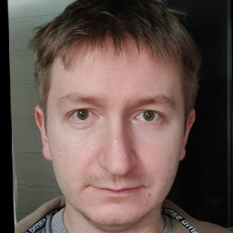

[EN](./README.md) | [RU](./README.ru.md)

РЕКОНСТРУКЦИЯ ТЕСТОВОГО НАБОРА ЭМБЕДИНГОВ `embedings_v3.pickle`:

 - загрузить архив: https://disk.yandex.ru/d/cTriN6tMzgHxUw

СКРИНКАСТЫ:

 - как запустить обучение декодера/адаптера: https://disk.yandex.ru/i/LpYopyLJYWYe4A
 - как запустить валидацию: https://disk.yandex.ru/i/qgAYH3wQyz967w
 - как запустить демо реконструкции: https://disk.yandex.ru/i/7Eu7Hu73S4tr1Q
 - как запустить демо защиты: https://disk.yandex.ru/i/8Jl8nJUhlVOAvA

RBH24
===

Это решение SystemFailure для Российского Биометрического Хакатона 2024

Мы показали:

1. Биометрический шаблон может быть восстановлен до фотографии лица с высоким коэффициентом косинусного сходства с оригинальным шаблоном. 
   Для двух тестовых наборов, для нашего самого сильного алгоритма реконструкции, мы измерили положительный уровень совпадения на уровне 100 %.

Таблица 1 - производительность реконструкции

| Тестовый набор   | ID   | Образцов/ID | Демография          | PMR@1E-6 (Наш декодер) | PMR@1E-6 (Наш адаптер для InstantID) | PMR@1E-6 (Наш декодерV2) |
|------------------|------|-------------|---------------------|------------------------|--------------------------------------|--------------------------|
| **valface**      | 1143 | 1           | Белые, Черные, Азиаты | 34.2 %                 | 75.9 %                               | 100 %                    |
| **glint**        | 1000 | 1           | Белые, Черные, Азиаты | 25.3 %                 | 78.3 %                               | 100 %                    |
| **embedding_v3** | 101  | N/A         | N/A                 | N/A                    | 87.1 %                               | 100 %                    |

Где:

 - PMR@1E-6 - это положительный уровень совпадения для `insightface/buffalo_l` при [False Match Rate 1E-6](./researches/README.md)

 - **valface** - вручную собранные фотографии. В основном неизвестные личности

 - **glint** - Подмножество первых 1K идентификаторов из набора данных glint. Разнообразные позы, размытые лица, эмоции, окклюзии

2. Для создания относительно небольшого алгоритма реконструкции могут быть украдены данные из биометрической системы. Наш самый сильный 
   алгоритм реконструкции был обучен всего на 4K пар высококачественных фотографий и шаблонов!

3. Мы разработали и оценили надежный, но вычислительно эффективный метод для защиты биометрических шаблонов от атак реконструкции. Этот подход использует координаты лицевых ориентиров для генерации ключей шифрования. Наш анализ показывает, что предложенный метод защиты сохраняет производительность биометрических систем идентификации, сохраняя как False Non-Identification Rate (FNIR), так и False Positive Identification Rate (FPIR) на их исходных уровнях, при этом эффективно снижая положительный уровень совпадения реконструированных изображений лица до нуля.

Таблица 2 - производительность защиты

| Метрика                          | Наш адаптер для InstantID | Наш декодер       | Наш декодерV2     |
|----------------------------------|---------------------------|-------------------|-------------------|
| **Количество уникальных идентификаций** | 1777                      | 1777              | 1777              |
| **Минимальное косинусное значение**    | -0.1827                   | -0.1728           | -0.1735           |
| **Среднее косинусное значение**        | 0.0190                    | 0.0120            | 0.0091            |
| **Медианное косинусное значение**      | 0.0166                    | 0.0111            | 0.0101            |
| **Максимальное косинусное значение**   | 0.1953                    | 0.1761            | 0.1539            |
| **PMR@1E-6**                      | 0 из 1777 (0.0 %)         | 0 из 1777 (0.0 %) | 0 из 1777 (0.0 %) |

### Примеры

| Оригинальное фото               | Наш адаптер для InstantID                                     | Наш декодер                                      | Наш декодерV2                                      |
|--------------------------------|---------------------------------------------------------------|--------------------------------------------------|----------------------------------------------------|
|    | .jpg) | .png) | .png) |
|                                | Cosine: 0.7578                                                | Cosine: 0.5390                                   | Cosine: 0.8508                                     |
|    | .jpg) | .png) | .png) |
|                                | Cosine: 0.8520                                                | Cosine: 0.5383                                   | Cosine: 0.8845                                     |
|    | .jpg) | .png) | .png) |
|                                | Cosine: 0.7562                                                | Cosine: 0.6774                                   | Cosine: 0.8930                                     |
|    | .jpg) | .png) | .png) | 
|                                | Cosine: 0.7029                                                | Cosine: 0.6036                                   | Cosine: 0.9049                                     |

### Установка

Подготовьте машину с GPU, совместимым с CUDA12, и минимум 24GB VRAM (проверено: RTX3090, RTX4090)

```bash
python3.10 -m virtualenv ./venv
source ./venv/bin/activate
pip install -r requirements.txt
```

### Структура репозитория

1. [./templatesgen](./templatesgen) - скрипты для создания пар фотографий + биометрических шаблонов

2. [./train_naive_decoder](./train_naive_decoder) - инструменты для обучения декодера шаблона в фотографию

3. [./train_adapter_for_instantid](./train_adapter_for_instantid) - инструменты для обучения адаптера для instantid

4. [./train_decoder_with_fr_loss](./train_decoder_with_fr_loss) - инструменты для обучения продвинутого декодера

5. [./researches](./researches) - некоторые исследования, которые мы провели по пути

6. [./protection](./protection) - исследование защиты биометрических шаблонов
