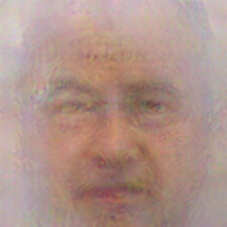
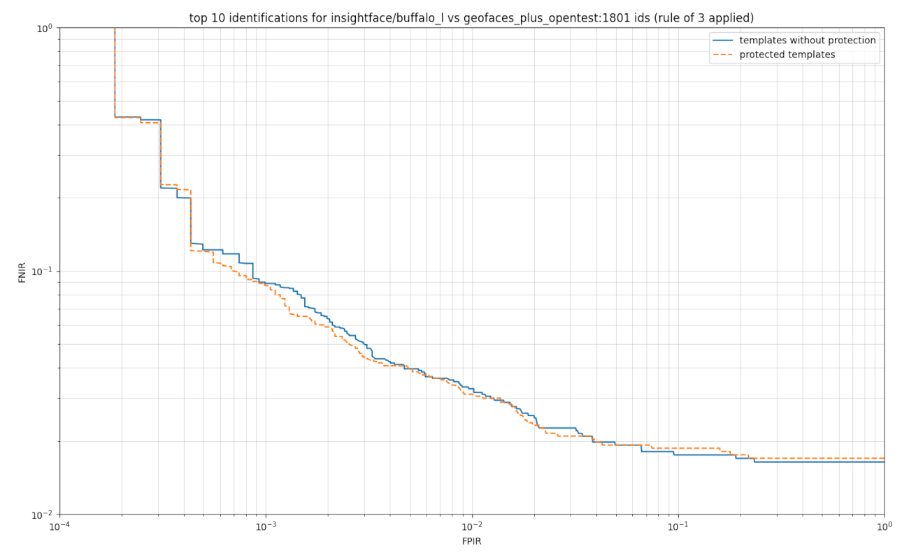
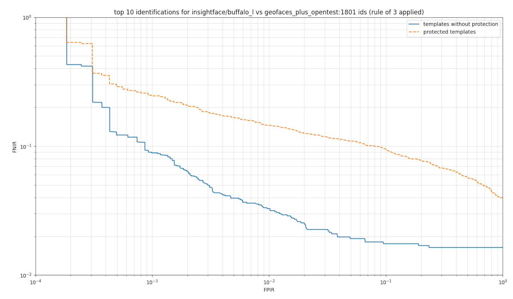

# Protection

Here we discuss how to protect biometric templates against reconstruction by means of encoding with key generated from photo 

## Scheme of work

## How we protect templates

We encrypt biometric templates by keys that are computed from facial landmarks coordinates. On client side we use landmarks
from identification photo. On server side we use landmarks averaged acros all registration photos. Our method could work
with 68 facial keypoints and 5 facial key points. Implementation of `encription` and `decription` functions could be find in
[sources](../train_adapter_for_instantid/protection.py).

Protection demos have been moved:

 - [protection against decoder](../train_naive_decoder/protection_demo.py)
 - [protection against adapter](../train_adapter_for_instantid/protection_demo.py)
 - [protection against decoderV2](../train_decoder_with_fr_loss/protection_demo.py)

They demonstrate effectiveness of the same protection method against two reconstruction methods.  

## Examples of faces reconstructed from encrypted templates

|                                      Our adapter for InstantID                                      |                                     Our decoder                                     |                                       Our decoderV2                                       |
|:---------------------------------------------------------------------------------------------------:|:-----------------------------------------------------------------------------------:|:-----------------------------------------------------------------------------------------:|
|  |  |  |
|                                            COSINE: 0.073                                            |                                    COSINE: 0.010                                    |                                       COSINE: 0.055                                       |
|  |  |  |
|                                           COSINE: -0.051                                            |                                    COSINE: 0.032                                    |                                      COSINE: -0.088                                       |
|  |  |  |
|                                            COSINE: 0.019                                            |                                    COSINE: 0.091                                    |                                      COSINE: -0.001                                       |
|  |  |  |
|                                            COSINE: 0.038                                            |                                    COSINE: 0.030                                    |                                       COSINE: 0.058                                       |
|  |  |  |
|                                            COSINE: 0.005                                            |                                    COSINE: 0.029                                    |                                      COSINE: -0.027                                       |
|  |  |  |
|                                            COSINE: 0.014                                            |                                    COSINE: 0.067                                    |                                      COSINE: -0.001                                       |

## Does protection corrupts identification performance?

No! Face identification performance could be preserved.

Identification characteristic for keys generated from 5 facial landmarks:

But not any facial data are suitable for our encryption method!  
Identification characteristic for keys generated from 106 facial landmarks:

However, for both 5 and 106 landmarks, our protection shows for reconstructed faces PMR@FMR=1E-6: 0 of 1777 (0.0 %)  