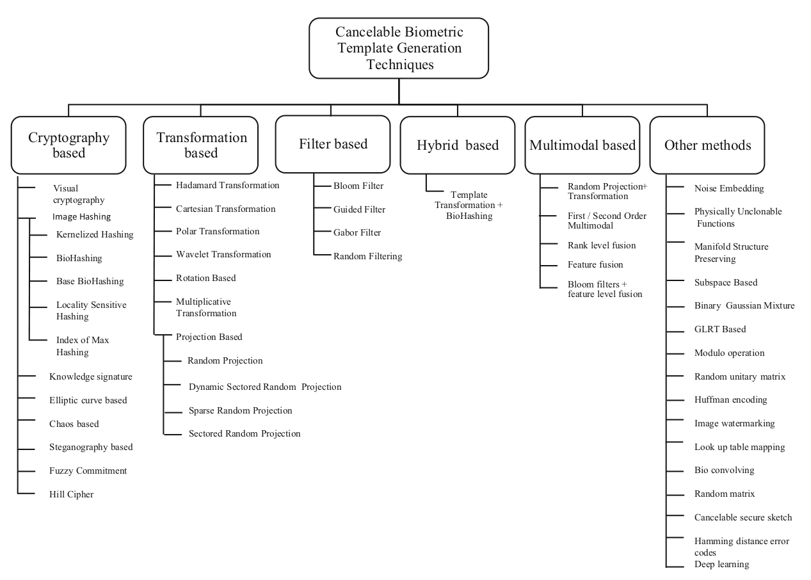

# Protection

RETHINK EVERITHUNG !!!!!!!!!!!!!!!!!!!!!!!!!!!!

MAKE RUSSIAN DESCRIPTION!!!!!!!!!!!!!!!!!!!!!!!!!

Here we discuss how to protect biometric templates against reconstruction

### 1. Special distortion of the photo

For the instance: patching, watermarks, coordinate transforms, etc.

pros:

 + could make reconstructed photo looks not like the normal face

cons:

 - feature extractor should be trained with distortion
 - performance of feature extractor is likely to drop (higher FMR and FNMR)

### 2. Biometric template augmentation

Could such tactics even protect anything from reconstruction? 

### 3. Liveness for biometric templates

We have found that norm of vectors from the face generated by InstatID are different from real.

pros: 
  
 + just add one new component to biometric pipeline

cons:

 - classification accuracy could be low

## Known approaches

What literature says?

[Cancelable Biometrics: a comprehensive survey](https://www.researchgate.net/publication/336386976_Cancelable_Biometrics_a_comprehensive_survey)

