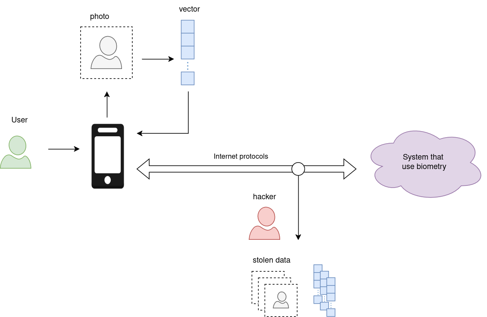
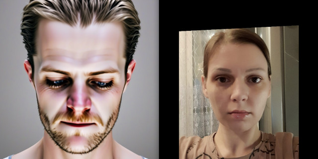
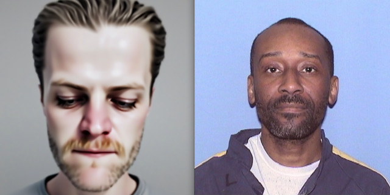
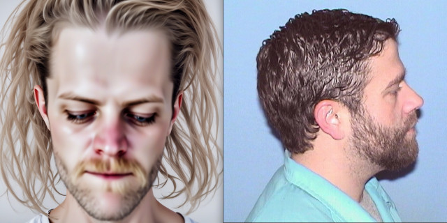
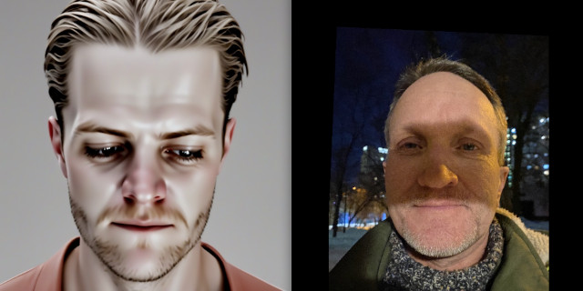
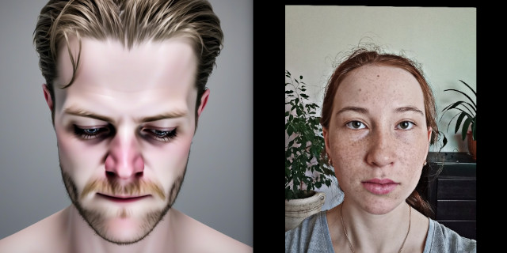
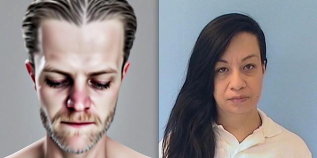

# Protection

Here we discuss how to protect biometric templates against reconstruction by means of encoding with key generated from photo 

## Scheme of work

## How we will protect templates

We encrypt biometric templates by keys that are computed from facial landmarks coordinates. On client side we use landmarks
from identification photo. On server side we use landmarks averaged acros all registration photos. Our method could work
with 68 facial keypoints and 5 facial key points. Implementation id encription and decription functions could be find in
[sources](../train_adapter_for_instantid/protection.py).

Protection demos have been moved:

 - [protection against decoder](../train_naive_decoder/protection_demo.py)
 - [protection against adapter](../train_adapter_for_instantid/protection_demo.py)

They demonstrate effectiveness of the same protection method against two reconstruction methods.  

## Examples of faces reconstructed from encrypted templates

COSINE: 0.073

COSINE: -0.051

COSINE: 0.019

COSINE: 0.038

COSINE: 0.005

COSINE: 0.014
