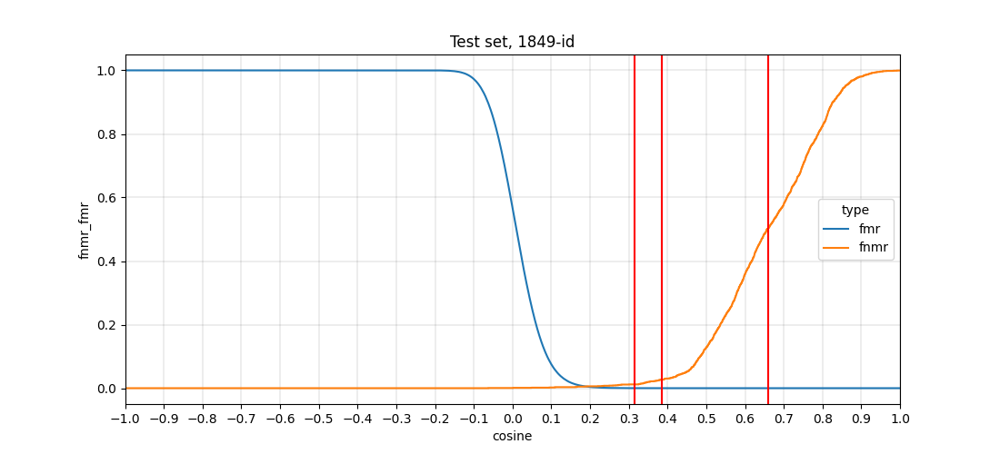
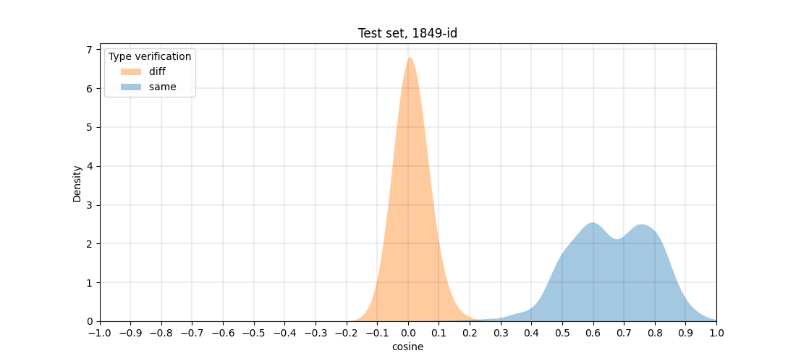
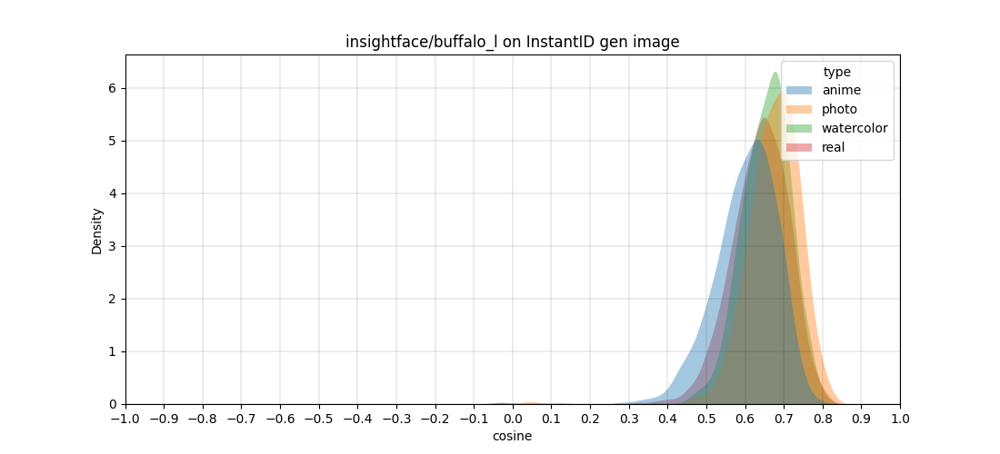
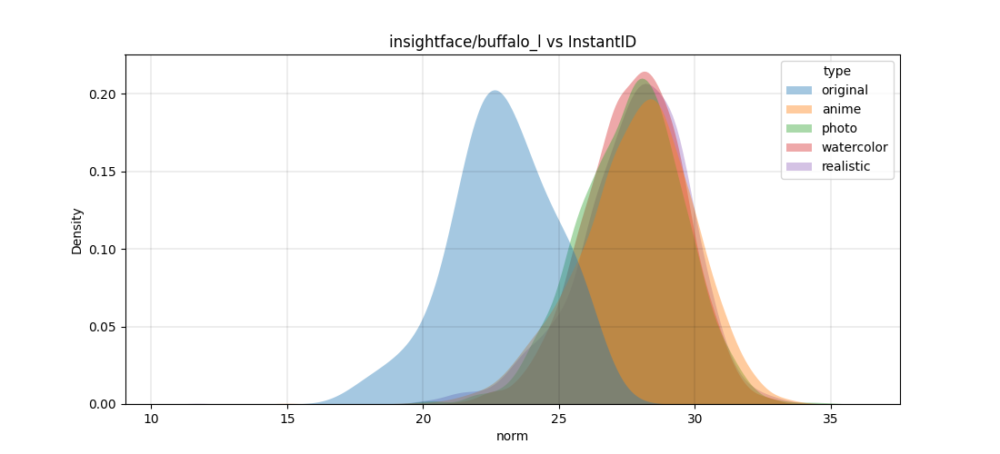

RESEARCHES
===

Here you can find some of our researches/insights that we have collected along the way 

## insightface/buffalo_l

We have measured cosine (0.661) for FMR=1E-6 on independent dataset (nor glint or wabfaces):  

## InstantID

TO-DO - add description

