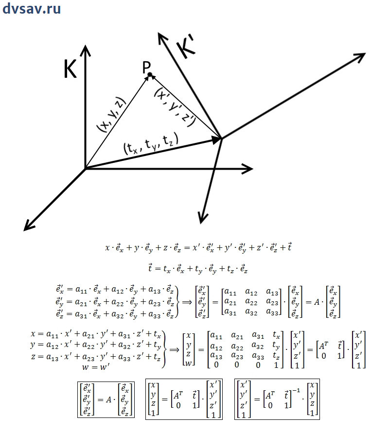

# InstantID

Here we explore of how to train adapter for stable diffusion for face from biometric vector reconstruction

Reasoning:

1. there is a high quality and open source InstanceID model to generate faces from antelope_v2 feature vector
2. we have the restriction for attacked model (buffalo_l)
3. we can train buffalo_l to antelope_v2 feature mapper, and if it's quality will be high enough, we will be able to reconstruct similar face from such mapped feature vector

The visualization of the transition to a new basis in 3D:

## Key results

* Single Linear layer is enough to make a transition from buffalo_l features space to antelope_v2 features space and achieve metrics average MSE= & average_cos = COS= 
* 10k persons with single photo is enough to generate adapted vectors close to directly extracted vectors 

## Results preview

Adapter `buffalo2atelope_adapler_analytical.onnx`

cosine: 0.673
   

cosine: 0.730

cosine: 0.711

cosine: 0.745

