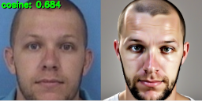

# InstantID

Here we explore of how to train adapter for stable diffusion for face from biometric vector reconstruction.

[InstantID](https://github.com/instantX-research/InstantID) is control-net for stable diffusion image generator. It was 
trained specifically to condition image generation by face similarity score for `insightface/antelopev2`.

If you are only interested in how to run reconstruction, go to [demo section](#Demo) 

## Experiment reasoning

1. there is a high quality and open source InstanceID model to generate faces from `insightface/antelopev2` feature vector
2. we have the restriction for attacked model (`insightface/buffalo_l`)
3. we can train `insightface/buffalo_l` to `insightface/antelopev2` feature mapper, and if it's quality will be high enough, we will be able to reconstruct similar face from such mapped feature vector

The visualization of the transition to a new basis in 3D:


## Key results

* We have used ordinary least squares (OLS) to find transformation matrix from `insightface/buffalo_l` features space to `insightface/antelopev2` features space  
* Single Linear layer is enough to make a transition from `insightface/buffalo_l` features space to `insightface/antelopev2` features space 
* 10k persons with single photo guarantees the generation of adapted vectors close to directly extracted vectors
* 1k persons with single photo is enough to generate some percent of adapted vectors close to directly extracted vectors

OSE (ordinal square error) on training data:

| N persons | N vectors | mean MSE | mean COS |
|-----------|-----------|----------|----------|
| 180k      | 8.6m      | 0.19     | 0.9      |
| 100k      | 100k      | 0.19     | 0.9      |
| 10k       | 10k       | 0.20     | 0.9      |
| 1k        | 1k        | 0.39     | 0.82     |
| 100       | 100       | 0.83     | 0.47     |


## Validation of adapter_HQ_4000

This adapter was trained on only 4K of photo-template pairs (4K unique ids, single photo-template pair per id)

            
            
            
           

```
STATISTICS ON 1143 TEST SAMPLES FROM 'valface':
 - COSINE MIN:    -0.0550
 - COSINE MEAN:   0.7127
 - COSINE MEDIAN: 0.7365
 - COSINE MAX:    0.8553
TOTAL: 870 of 1143 have cosine with genuine template greater than 0.661 >> it is 76.1 % of validation samples

STATISTICS ON 1000 TEST SAMPLES FROM 'glint':
 - COSINE MIN:    0.2915
 - COSINE MEAN:   0.6311
 - COSINE MEDIAN: 0.6424
 - COSINE MAX:    0.8479
TOTAL: 434 of 1000 have cosine with genuine template greater than 0.661 >> it is 43.4 % of validation samples
```

## Validation of adapter_100K

This adapter was trained on 100K of random ids (single photo-template pair per id)

            
            
            
           

```
STATISTICS ON 1143 TEST SAMPLES FROM 'valface':
 - COSINE MIN:    -0.0130
 - COSINE MEAN:   0.6970
 - COSINE MEDIAN: 0.7388
 - COSINE MAX:    0.8608
TOTAL: 867 of 1143 have cosine with genuine template greater than 0.661 >> it is 75.9 % of validation samples

STATISTICS ON 1000 TEST SAMPLES FROM 'glint':
 - COSINE MIN:    -0.0005
 - COSINE MEAN:   0.6938
 - COSINE MEDIAN: 0.7340
 - COSINE MAX:    0.8495
TOTAL: 783 of 1000 have cosine with genuine template greater than 0.661 >> it is 78.3 % of validation samples
```

## How to run training

```bash
pip install jupyterlab
jupyter-lab ./buffalo2antelope_adapter.ipynb  
```

And press RUN button

## How to run validation

1. Install [InstantID](https://github.com/instantX-research/InstantID) according to repo instructions
2. Copy `validate.py`, `tools.py`, `demo.py`, `protection.py` and `protection_demo.py` into root of InstantID installation folder
3. Run validation:

```bash 
python validate.py --set valface # it is database collected by SystemFailure (does not contain samples from glint nor webface)
python validate.py --set glint --max_ids 1000  # test part of glint dataset
```

## Demo

Demo is a simple script that reconstructs face photos for all files in specific input directory. This files could be 
original face photos (tebplate extraction by insightface/buffalo_l will be made) or templates in *.pkl or *.b64 formats.
For each suitable file in input reconstructed face will be saved with the same filename plus cosine similarity with
the original face template. Before run demo.py, download `buffalo2antelope_adapler_HQ_4K.onnx` file to local disk.

Link to download adapter: https://disk.yandex.ru/d/7Aq4f_V6bu1V4Q

```bash
python demo.py --input local_path_to_templpates_or_photos_to_reconstruct --output ./output --adapter ./models/buffalo_l_decoder_large_on_vgg11_v1.onnx
```

Do not forget to copy `./artifacts` and `./models` to InstatID installation folder!

To run protection demo (shows how to use photo to encrypt biometric template to protect it from reconstruction):

```bash
python protection_demo.py
```

```
STATISTICS ON 1777 UNIQUE PERSONS IDENTIFICATIONS:
 - COSINE MIN:    -0.1827
 - COSINE MEAN:   0.0190
 - COSINE MEDIAN: 0.0166
 - COSINE MAX:    0.1953
TOTAL: 0 of 1777 have cosine with genuine template greater than 0.661 >> it is 0.0 % of samples
```
