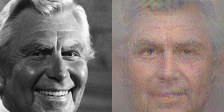

# Training of naive decoder

Here you can find training scripts and some validation results/artifacts for improved decoder training.

If you are only interested in how to run reconstruction, go to [demo section](#Demo) 
    
### Key idea:

EDA in train_adapter for InstanceID revealed highly similar mutual allocation of vectors for different persons in latent space ==> allnFR modelsextract similar patterns and another FR model is expected to work better in perceptual loss:

* we used CosFace resnet50 model trained on glint from []!(https://github.com/deepinsight/insightface/tree/master/recognition/arcface_torch) for perceptual loss
* removed similarity loss for photo and its reconstruction image in terms of pixels
* tried to add discriminator to make images more realistic

### Installation

```bash
pip install -r requirements.txt
```

### Run

Adjust config options in `./train.py`. Then run training:

```bash
python train.py
```

## Validation

```bash
python validate.py --set valface # it is database collected by SystemFailure (does not contain samples from glint nor webface)
python validate.py --set glint  # test part of glint dataset
```

### Example of training session

Log of the training session for decoder_large:
```
 - mean: [0.485, 0.456, 0.406]
 - std: [0.5, 0.5, 0.5]
 - swap_red_blue: True
 - crop_size: [112, 112]
 - batch_size: 200
 - num_epochs: 10
 - lr_scheduler: Cosine
 - perception_net_name: fr
 - latent_space_dims: 512
 - max_lr: 0.001
 - min_lr: 1e-05
 - max_grad_norm: 10.0
 - augment: False
 - normalize_templates: True
 - max_batches_per_train_epoch: -1
 - visualize_control_samples: 9
 - visualize_each_step: 1024
 - perceptual_loss_weight: 11.0
 - laplace_loss_weight: 1.0
 - mse_loss_weight: 1.0
 - use_discriminator: False
 - discr_weight: 0.01
 - run_name: wo_discr_wo_pixel_loss
 - model_name: buffalo_decoder_on_fr_wo_discr_wo_pixel_loss
 - save_powers: {1000, 10000, 100, 100000}
 - model size: 26.362 MB
 - perceptor (fr) size: 166.432 MB
Train dataset:
  - unique samples: 10629318
Test dataset:
  - unique samples: 569866
SELECTING SAMPLES FOR VISUAL CONTROL - please wait...
SELECTING SAMPLES FOR VISUAL CONTROL - success
TRAIN:
Epoch 0 >> loss 0.73991 | 10629200/10629318 ~ 100.0 % | 368 samples / s
 - loss:  0.84436 - improvement
TEST:
 - loss:  0.74602 - improvement
...
```

Test set probes 2nd epoch:

            
            
            

Test set similarity check after 2 epoches:

```
STATISTICS ON 1143 TEST SAMPLES FROM 'valface':
 - COSINE MIN:    0.7777
 - COSINE MEAN:   0.8826
 - COSINE MEDIAN: 0.8861
 - COSINE MAX:    0.9312
TOTAL: 1143 of 1143 have cosine with genuine template greater than 0.661 >> it is 100.0 % of validation samples

STATISTICS ON 1000 TEST SAMPLES FROM 'glint':
 - COSINE MIN:    0.6738
 - COSINE MEAN:   0.8773
 - COSINE MEDIAN: 0.8813
 - COSINE MAX:    0.9262
TOTAL: 1000 of 1000 have cosine with genuine template greater than 0.661 >> it is 100.0 % of validation samples
```


TO-DO...

Check number of single vectors per person which will be enough for training


## Demo:

Demo is a simple script that reconstructs face photos for all files in specific input directory. This files could be 
original face photos (tebplate extraction by insightface/buffalo_l will be made) or templates in *.pkl or *.b64 formats.
For each suitable file in input reconstructed face will be saved with the same filename plus cosine similarity with
the original face template. Before run demo.py, download `buffalo_decoder_on_fr_wo_discr_wo_pixel_loss_last.onnx` file to local disk.

Link to download decoder: https://disk.yandex.ru/d/6TR43zHhqMvjRg

```bash
python demo.py --input local_path_to_templpates_or_photos_to_reconstruct --output ./output --decoder ./weights/buffalo_decoder_on_fr_wo_discr_wo_pixel_loss_last.onnx.onnx
```

To run protection demo (shows how to use photo to encrypt biometric template to protect it from reconstruction):

```bash
python protection_demo.py
```

```
STATISTICS ON 1777 UNIQUE PERSONS IDENTIFICATIONS:
 - COSINE MIN:    -0.1735
 - COSINE MEAN:   0.0091
 - COSINE MEDIAN: 0.0101
 - COSINE MAX:    0.1539
TOTAL: 0 of 1777 have cosine with genuine template greater than 0.661 >> it is 0.0 % of samples
```
